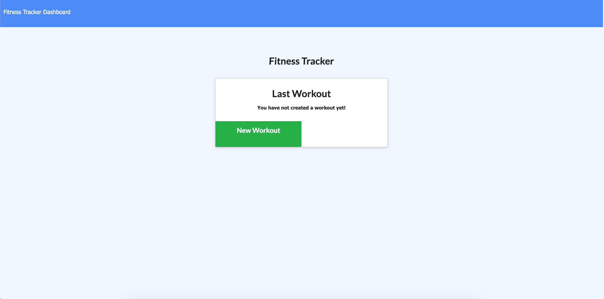
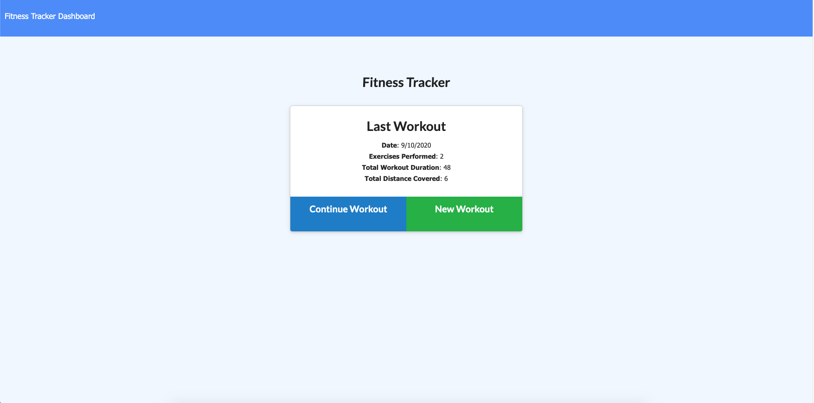
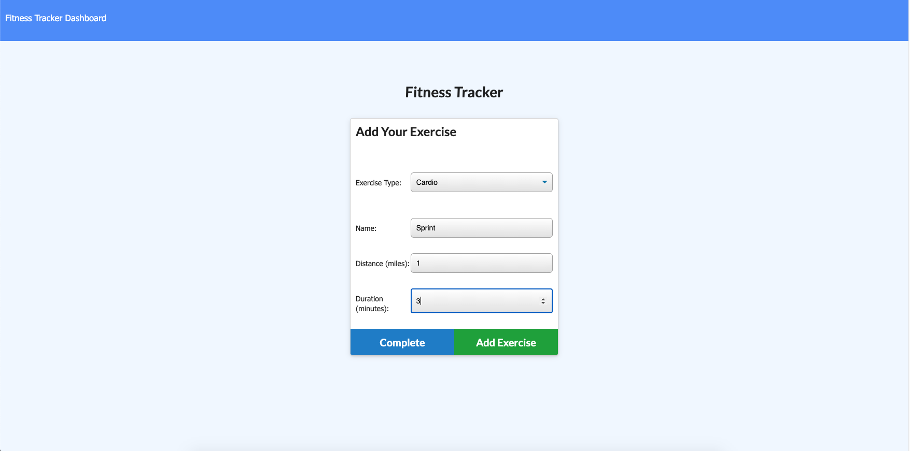
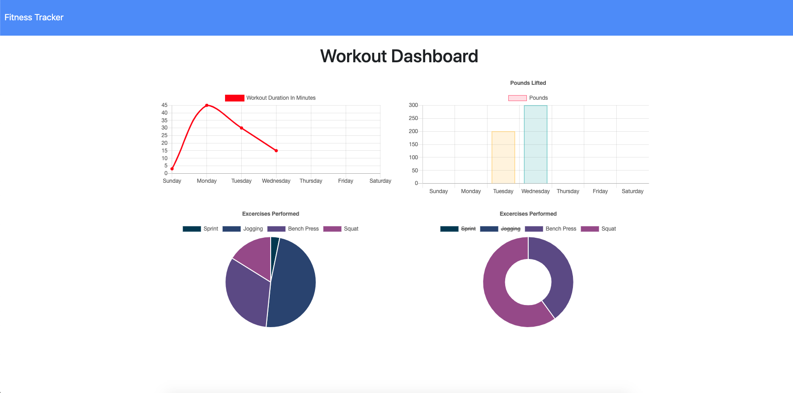

# Fitness Tracker

A web application that allows users to input and track their workouts on any given day. Users can input workouts, individual exercises, and view the stats for their workouts. The information for each workout is saved using a Mongo database. 

The application was built using Mongoose and Express, along with HTML, CSS, and JavaScript.

## Usage 

This application is deployed using Heroku, you can view the application [here](https://stormy-sands-79386.herokuapp.com/).

## Testing

Download the repository. Be sure to get all the dependencies by runnning the following in your terminal:

```bash
npm i
```

Start the server by running
```bash
node server.js
```

Go into your browser and type the following
> localhost:3000/

This will direct you to the homepage of the app. Make sure you have setup a Mongo database called `workouts` in order to store the workout information.

## Images

* The start of the application with no workouts tracked



* The start of the application with the last workout displayed



* Adding a workout



* Viewing the stats of your previous exercises


